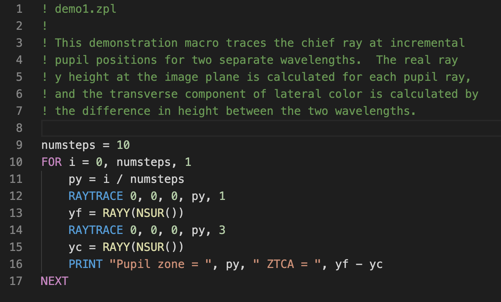

# Zemax OpticStudio ZPL language support for Visual Studio Code

This extension adds syntax highlighting and snippets for [Zemax OpticStudio](https://www.zemax.com/products/opticstudio) ZPL macros.

## Screenshot

## Changelog
Read the [CHANGELOG](CHANGELOG.md) to know what has changed over the last few versions of this extension.

## License
This extension is licensed under the MIT License - see the [LICENSE](LICENSE) for details.

## Contributing
Contributions are greatly appreciated. Please fork this repository and open a pull request to add snippets, make grammar tweaks, etc.
